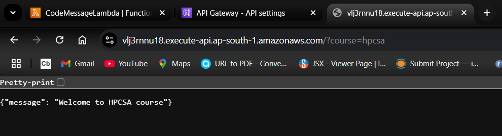
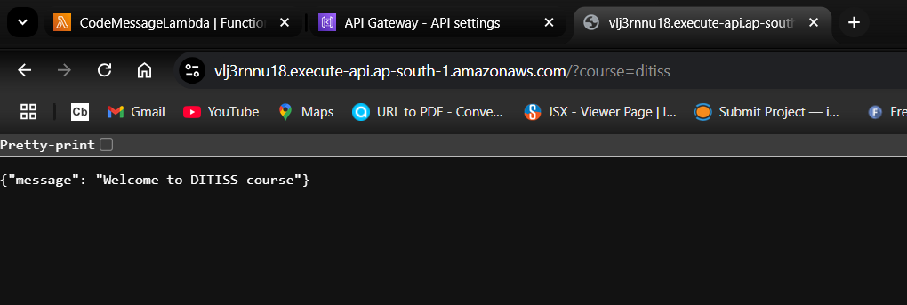
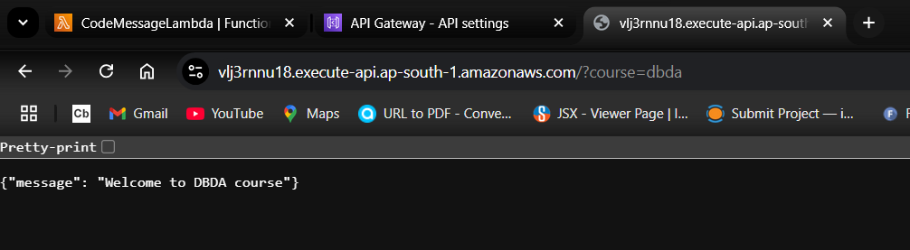
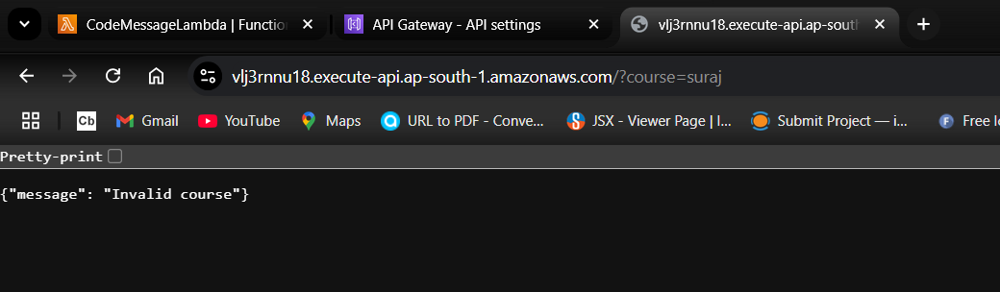

# AWS Lambda Function Implementation: Overview

### *Purpose:* 

#### This guide demonstrates how to create an AWS Lambda function and expose it via an API Gateway to handle HTTP requests. The Lambda function processes query parameters and returns dynamic responses, making it a useful tool for serverless applications.

### *Use Case:*

#### Imagine you are building a web application that provides custom messages based on user input (e.g., course selection). Instead of setting up a dedicated server, you can leverage AWS Lambda to handle the logic without worrying about infrastructure. The Lambda function processes the query parameters (course=hpcsa, course=ditiss, etc.) and returns the corresponding message.

### *Benefits:*
- #### Cost-Efficiency: With Lambda, you only pay for the compute time you consume, making it more cost-effective than traditional server hosting.
- #### Scalability: Lambda automatically scales to handle any number of requests, from a few to millions, without manual intervention.
- #### Serverless Architecture: You don't need to manage servers, reducing operational overhead and enabling a more agile development process.
- #### Easy Integration: API Gateway seamlessly integrates with Lambda, providing a simple way to expose your function as an HTTP endpoint.


<br>
<br>

# Follow the steps to implement:-

### Step 1: Create a Lambda Function in AWS

#### 1. Open the AWS Lambda Console:
- Go to the AWS Lambda Console.
  
 #### 2. Create a Lambda Function:
- Click Create function.
- Select Author from scratch.
- Set the function name as CodeMessageLambda.
- Select Python 3.x (latest version) as the runtime.
- Under Permissions, choose Use an existing role and select LambdaExecutionRole (or create a new role if you haven’t already).
- Click Create function.

  
#### 3. Add the Python Code:
*In the inline editor, replace the default code with the following:*

```yml
 import json

def lambda_handler(event, context):
    # Get the 'course' parameter from the query string
    course = event.get('queryStringParameters', {}).get('course', '')
    
    # Define messages based on the course parameter
    if course == "hpcsa":
        message = "Welcome to HPCSA course"
    elif course == "ditiss":
        message = "Welcome to DITISS course"
    elif course == "dbda":
        message = "Welcome to DBDA course"
    else:
        message = "Invalid course"
    
    # Return the response as JSON
    return {
        'statusCode': 200,
        'body': json.dumps({
            'message': message
        }),
        'headers': {
            'Content-Type': 'application/json'
        }
    }

```

*This code checks the code query parameter and returns a corresponding message.*

#### 4. Deploy the Function:

- Click Deploy to save and deploy the function.


### Step 2: Set Up an API Gateway to Call the Lambda Function

#### 1. Open the API Gateway Console:
- Go to the API Gateway Console.

#### 2. Create a New HTTP API:
- Click Create API.
- Choose HTTP API and click Build.

#### 3. Configure the API:

- Set the API name to CodeMessageAPI.
- Click Next.

#### 4. Set Up Lambda Integration:
- In Integrations, select Lambda.
- Choose the Lambda function you created (CodeMessageLambda).

#### 5. Create a Route:
- Under Routes, click Add route.
- Set the Method to ANY (this allows you to call the function with any HTTP method 
  like GET or POST).
- Set the Resource path to / (root path).
- Click Create.

#### 6. Deploy the API:

- Click on Deployments in the left sidebar.
- Click Create and enter a stage name, such as prod.
- Click Deploy.
  
#### 7. Get the API URL:
*After deploying, note the Invoke URL. This URL will be similar to:*

```yml
https://abcd1234.execute-api.us-east-1.amazonaws.com
```

### Step 3: Test the API

#### 1. Access the URL in Your Browser:
*Open your browser and enter the API URL with the query parameter code:*

```yml
https://abcd1234.execute-api.us-east-1.amazonaws.com/?course=hpcsa
```

#### 2. Expected Output:
*You should see a JSON response similar to:*

```yml
{
    "Welcome to HPCSA course"
}
```

#### 3. Test with Different Codes:

*Test the API URL with the new course parameter values:*

```yml
/?course=hpcsa → Should return "Welcome to HPCSA course"
/?course=ditiss → Should return "Welcome to DITISS course"
/?course=dbda → Should return "Welcome to DBDA course"
/?course=unknown → Should return "Invalid course"
```

### Step 4: Clean Up (Optional)
*To avoid ongoing costs, you can delete the resources you created:*

- Delete the Lambda function: Go to the Lambda Console and delete CodeMessageLambda.
- Delete the API Gateway: Go to the API Gateway Console and delete CodeMessageAPI.


<br>
<br>


## Summary
*By following these steps, you can :*

- Created a Python Lambda function to process query parameters.
- Set up an API Gateway to make the function accessible via an HTTP endpoint.
- Accessed the function through a URL like https://abcd1234.execute-api.us-east-1.amazonaws.com/?course=hpcsa to retrieve responses based on the code query parameter.

<br>
<br>

### *In summary, this setup allows you to quickly implement serverless, cost-effective, and scalable HTTP APIs with minimal infrastructure management.*


<br>
<br>


----------------Screenshots---------------




<br>
----------------------------------------------------------------------------------
<br>



<br>
----------------------------------------------------------------------------------
<br>



<br>
----------------------------------------------------------------------------------
<br>



<br>
<br>


<br>
<br>
<br>
<br>


**👨‍💻 𝓒𝓻𝓪𝓯𝓽𝓮𝓭 𝓫𝔂**: [Suraj Kumar Choudhary](https://github.com/Surajkumar4-source) | 📩 **𝓕𝓮𝓮𝓵 𝓯𝓻𝓮𝓮 𝓽𝓸 𝓓𝓜 𝓯𝓸𝓻 𝓪𝓷𝔂 𝓱𝓮𝓵𝓹**: [csuraj982@gmail.com](mailto:csuraj982@gmail.com)


<br>
